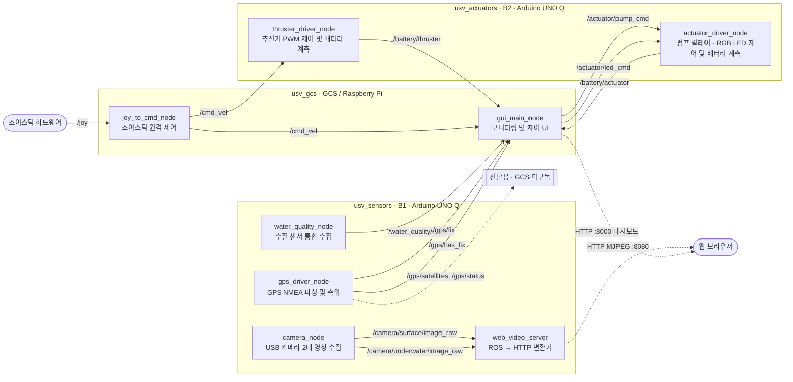

# 6can_usv_project — 협업 템플릿

이 저장소는 아래 "0. 시스템 요구사항"에 맞춘 **기본 뼈대(scaffolding)**입니다.
ROS 2 토픽 이름, 메시지 타입, 노드 구조, launch 파일은 이미 이 요구사항과 일치하도록
맞춰져 있습니다. 

💡 다만 토픽 인터페이스(이름/타입)만 준수한다면 내부 클래스 구조, 파일 분할, 알고리즘 구현은 담당자가 자유롭게 재구성해도 괜찮습니다.

> 자리표시자는 전부 코드에 `TODO(B1 담당자):`, `TODO(B2 담당자):`, `TODO(GCS 담당자):`
> 주석으로 표시해뒀습니다. **아래 문자열을 그대로 복사해서 검색하세요** — "담당자" 자리에
> 본인 파트 이름을 바꿔 넣지 말고, 태그 자체가 이 고정된 문자열입니다.
>
> ```bash
> # 전체 TODO 찾기
> grep -rn "TODO(" usv_ws/src
>
> # 담당자별로 찾기 
> grep -rn "TODO(B1 담당자):" usv_ws/src
> grep -rn "TODO(B2 담당자):" usv_ws/src
> grep -rn "TODO(GCS 담당자):" usv_ws/src
> ```

## 0. 시스템 요구사항

- **ROS 2 버전**: ROS 2 Jazzy Jalisco. 세 보드 모두 같은 `ROS_DOMAIN_ID`를 쓴다 (Wi-Fi 기반 DDS 분산 통신이라 도메인 ID가 다르면 서로 안 보인다).
- **하드웨어 구성**: 지상 관제소(GCS)는 Raspberry Pi, 수상정(USV) 본체는 Arduino UNO Q 2대(B1, B2)로 구성된다.
- **Docker 필수 조건**: 호환성 문제로 인해 **Arduino UNO Q에서 도는 모든 ROS 2 노드(B1, B2)는 Docker 컨테이너 환경 안에서 빌드·실행**한다 (`--privileged`, `-v /dev:/dev` 등 디바이스 마운트 적용). GCS(Raspberry Pi)는 이 조건 대상이 아니다.
- **이번 범위에서 제외한 것**: Failsafe 감시 노드(`watchdog_node`)와 heartbeat 패키지는 개발 범위에서 완전히 제외했다. 그래서 추진기 드라이버는 `/cmd_vel_safe`가 아니라 `/cmd_vel`을 직접 구독한다.
- **GPS 진단 토픽 처리 규칙**: `gps_driver_node`의 `/gps/satellites`, `/gps/status` 발행 로직은 코드 안에 유지하되, GCS GUI는 이 두 토픽을 구독하지 않는다.

## 1. 아키텍처 한눈에 보기

| 보드 | 패키지 | 담당 | 실행 환경 |
|---|---|---|---|
| B1 (Arduino UNO Q) | `usv_sensors` | 수질/GPS/카메라 담당 | Docker (필수) |
| B2 (Arduino UNO Q) | `usv_actuators` | 추진기/펌프·LED 담당 | Docker (필수) |
| GCS (Raspberry Pi) | `usv_gcs` | GUI/조종 담당 | 네이티브 실행 (Docker 불필요) |

```
usv_ws/src/
├── usv_sensors/     # B1 — water_quality_node, gps_driver_node, camera_node
├── usv_actuators/   # B2 — thruster_driver_node, actuator_driver_node
└── usv_gcs/         # GCS — gui_main_node, joy_to_cmd_node
```

아래 표가 이 프로젝트의 **인터페이스 계약**입니다. 토픽 이름이나 메시지 타입을 바꿔야
한다면 **이 표부터 고치고 팀 전체에 공유한 다음** 코드를 맞추세요 (거꾸로 하면 안 됩니다 —
누군가 조용히 코드만 바꾸면 다른 파트가 구독/발행하는 토픽과 어긋납니다).

| 토픽 | 타입 | 발행 | 구독 |
|---|---|---|---|
| `/water_quality/data` | `std_msgs/msg/String` (JSON) | `usv_sensors` | `usv_gcs` |
| `/gps/fix` | `sensor_msgs/msg/NavSatFix` | `usv_sensors` | `usv_gcs` |
| `/gps/has_fix` | `std_msgs/msg/Bool` | `usv_sensors` | `usv_gcs` |
| `/gps/satellites`, `/gps/status` | `UInt8`, `String` | `usv_sensors` | (미구독, 진단용) |
| `/camera/surface/image_raw`, `/camera/underwater/image_raw` | `sensor_msgs/msg/Image` | `usv_sensors` | `web_video_server` → GCS 웹 UI |
| `/cmd_vel` | `geometry_msgs/msg/Twist` | `usv_gcs`(joy_to_cmd_node) | `usv_actuators`, `usv_gcs`(내부 표시) |
| `/battery/thruster` | `std_msgs/msg/Int32MultiArray` | `usv_actuators` | `usv_gcs` |
| `/battery/actuator` | `std_msgs/msg/Int32` | `usv_actuators` | `usv_gcs` |
| `/actuator/pump_cmd` | `std_msgs/msg/Bool` | `usv_gcs` | `usv_actuators` |
| `/actuator/led_cmd` | `std_msgs/msg/ColorRGBA` | `usv_gcs` | `usv_actuators` |

### 노드 다이어그램

목표로 하는 최종 구조입니다 (진행 상황 표시 아님 — 뭐가 끝났고 뭐가 남았는지는 4항 체크리스트
참고). 네모=노드, 화살표 위 글자=토픽 이름, 점선=ROS 토픽이 아니거나(HTTP) GCS가 구독하지
않는 진단용 흐름입니다. `watchdog_node`/`heartbeat`/`usv_teleop`는 0항에 따라 이번 범위에서
제외되어 있어 다이어그램에도 없습니다.



## 2. 공통 준비 (모든 보드)

```bash
git clone <이 저장소>
cd usv_project/usv_ws
colcon build --symlink-install
source install/setup.bash
```

## 3. 보드별 빌드 & 실행

### B1 — `usv_sensors` (Docker)

```bash
cd usv_ws/src/usv_sensors
pip install -r requirements.txt          # 이미지 안에서는 Dockerfile이 자동으로 처리함
./start_sensors.sh                       # 이미지 빌드(최초 1회) → 컨테이너 실행
./install_autostart.sh                   # (선택) 부팅 시 자동 실행 등록
```

카메라 장치 번호는 명령줄로 넘기지 않는다. `usv_ws/src/usv_sensors/config/sensors_params.yaml`
파일의 `surface_device`/`underwater_device` 값을 실제 번호로 고치면, 다음 실행부터 자동으로
반영된다.

### B2 — `usv_actuators` (Docker)

```bash
cd usv_ws/src/usv_actuators
./start_actuators.sh
./install_autostart.sh                   # (선택)
```

파라미터 오버라이드 예시 (모터 드라이버 PWM 범위 확정 후):
```bash
ros2 launch usv_actuators actuators.launch.py max_pwm:=180
```

### GCS — `usv_gcs` (Docker 불필요, Raspberry Pi 네이티브)

```bash
sudo apt install ros-jazzy-web-video-server ros-jazzy-joy
pip install -r usv_ws/src/usv_gcs/requirements.txt
cd usv_ws
colcon build --symlink-install
source install/setup.bash
ros2 launch usv_gcs gcs.launch.py
```

브라우저에서 `http://<GCS IP>:8000` 접속하면 대시보드가 뜹니다.

파라미터 오버라이드 예시 (조이스틱 축 확정 후):
```bash
ros2 launch usv_gcs gcs.launch.py linear_axis:=1 angular_axis:=0
```

---

## 4. 파트별 작업 가이드

> 아래는 참고용 가이드일 뿐입니다. **1항의 토픽 이름/메시지 타입(입출력)만 그대로
> 유지하면**, 내부 구현(파일 나누는 방식, 클래스 구조, 로직)은 담당자가 편한 대로
> 완전히 새로 짜도 됩니다. 체크리스트는 "이 정도는 확인해보면 좋다" 수준이지
> "반드시 이 순서로 이 코드를 고쳐야 한다"는 뜻이 아닙니다.

### B1 담당자 — `usv_sensors`

**이미 되어있는 것**
- `water_quality_node`: 기존 `gps_and_water_quality_and_ros`(`ros_led`)의 수질 센서 로직을
  그대로 포팅. `/water_quality/data` 토픽 하나로 JSON을 중계함. **수정 불필요.**
- `gps_driver_node`: 기존 `gps.py`를 거의 그대로 포팅. `/gps/fix`, `/gps/has_fix` 발행 로직
  포함. **수정 불필요.**
- `camera_node`: OpenCV로 USB 카메라 2대를 열어 `sensor_msgs/Image`로 발행하는 구조는 완성.

**참고할 만한 것 (자유롭게 바꿔도 됨)**
- [ ] `config/sensors_params.yaml`의 `surface_device`/`underwater_device` 값(현재 0, 2) —
      실제 보드에서 `v4l2-ctl --list-devices`로 확인한 번호로 이 YAML 파일만 고치기
      (코드나 launch 파일은 안 고쳐도 됨)
- [ ] 카메라 해상도/포맷이 고정 크기가 필요하면 `cv2.VideoCapture`에 `set(cv2.CAP_PROP_...)`
      호출 추가
- [ ] Arduino 스케치(`sketch/`)는 water_quality/gps 부분은 기존 것 재사용 가능. 카메라는
      MCU를 거치지 않고 Linux 쪽에서 직접 잡으므로 스케치 수정 불필요.

**동작 확인용 참고**: `ros2 topic echo /camera/surface/image_raw --once`, `/camera/underwater/image_raw --once`로 실제 프레임이 찍히는지 확인.

### B2 담당자 — `usv_actuators`

**이미 되어있는 것**
- ROS 인터페이스(토픽 이름/타입, `/cmd_vel` 직접 구독, 배터리 발행 구조)는 완성.
- `/cmd_vel` → 좌/우 추진기 PWM 믹싱 공식(차동 구동)까지는 구현됨.

**참고할 만한 것 — 이 패키지가 가장 미완성 상태입니다 (자유롭게 바꿔도 됨)**
- [ ] Arduino 스케치(B2 보드용, 아직 없음)에 아래 RPC 핸들러 구현:
  - `set_thruster_pwm(left, right)` — 실제 모터 드라이버 핀에 PWM 출력
  - `get_thruster_battery()` — 추진기 배터리 잔량(0~100 정수 1~2개) 반환
  - `set_pump(on)` — 펌프 릴레이 on/off
  - `set_actuator_led(r, g, b)` — RGB LED 핀 출력 (0~255, PWM 밝기 조절). 
  - `get_actuator_battery()` — 제어 배터리 잔량(0~100 정수) 반환
  - RPC 이름을 다르게 짓고 싶으면 `thruster_driver_node.py`, `actuator_driver_node.py`의
    `Bridge.notify(...)`/`Bridge.call(...)` 호출부(`grep -n "TODO(B2" *.py`로 위치 확인)만
    고치면 됨
- [ ] 배터리 값이 %가 아니라 전압(V)으로 온다면 `read_battery()` 안에 환산식 추가
- [ ] `thruster_driver_node.py`의 좌/우 믹싱 공식이 실제 추진기 배치(개수, 위치)와 다르면
      `on_cmd_vel()` 로직 교체
- [ ] `usv_actuators/app.yaml`을 실제 Arduino App Lab 앱 이름에 맞춰 확인

**동작 확인용 참고**: `ros2 topic pub /cmd_vel geometry_msgs/msg/Twist "{linear: {x: 0.5}}"`로
실제 추진기가 반응하는지, `ros2 topic echo /battery/thruster`로 값이 들어오는지 확인.

### GCS 담당자 — `usv_gcs`

**이미 되어있는 것**
- `joy_to_cmd_node`: `/joy` → `/cmd_vel` 변환 로직 완성 (축 번호만 확인 필요).
- `gui_main_node`: 모든 구독/발행 배선 완성. Flask 웹 대시보드(`dashboard_html.py`)가
  수질/GPS/배터리/cmd_vel을 1초 주기로 갱신, 펌프 on/off·LED 색상 컨트롤 포함.
  듀얼 카메라 스트림은 `web_video_server` 주소를 그대로 ``로 표시.

**참고할 만한 것 (자유롭게 바꿔도 됨)**
- [ ] 실제 조이스틱으로 `ros2 topic echo /joy` 찍어서 축 번호 확인 → `gcs.launch.py`의
      `linear_axis`/`angular_axis` 인자로 반영 (코드 안 고쳐도 됨)
- [ ] `dashboard_html.py`는 기능 위주로 최소한만 스타일링 되어있음 — 디자인/레이아웃은
      자유롭게 다듬어도 됨 (API 응답 구조 `/api/state`는 바꾸지 말 것, `gui_main_node.py`와
      계약이 걸려 있음)
- [ ] `gui_main_node.py`의 `BATTERY_WARNING_PCT`(20%)는 실제 배터리 사양 확정되면 조정
- [ ] GPS 배너("⚠ GPS 신호 없음")나 배터리 경고색 기준 등 UX는 자유롭게 개선 가능

**동작 확인용 참고**: `usv_sensors`/`usv_actuators`를 동시에 띄운 상태에서 대시보드
(`http://<GCS IP>:8000`)에 실시간 값이 다 뜨는지, 펌프/LED 버튼이 실제로 동작하는지 확인.

---

## 5. 설계 결정 확인 사항 (0항 요구사항을 그대로 따른 부분)

- `watchdog_node`(failsafe)는 0항 "이번 범위에서 제외한 것"에 따라 **아예 만들지 않았습니다.**
  `thruster_driver_node`는 `/cmd_vel_safe`가 아니라 `/cmd_vel`을 직접 구독합니다.
- `/gps/satellites`, `/gps/status`는 `gps_driver_node` 안에 발행 코드는 남겨뒀지만,
  `gui_main_node`는 구독하지 않습니다 (0항 "GPS 진단 토픽 처리 규칙").
- `usv_interfaces`(커스텀 msg) 패키지는 **만들지 않았습니다.** 이 프로젝트의 인터페이스
  규격이 전부 `std_msgs`/`sensor_msgs`/`geometry_msgs` 표준 타입만 쓰도록 확정되어 있어서,
  한때 검토했던 커스텀 msg 계획은 폐기된 것으로 보고 반영했습니다.

## 6. Docker 관련 참고

0항의 Docker 필수 조건은 **UNO Q에서 도는 `usv_sensors`, `usv_actuators`에만 해당**하고
Raspberry Pi의 `usv_gcs`에는 적용되지 않습니다 (그래서 `usv_gcs`에는 Dockerfile이 없습니다).

`usv_sensors/`, `usv_actuators/` 각 폴더 안에 아래 파일들이 들어있어서, 나중에 각 패키지가
독립 레포로 분리되어도 그대로 쓸 수 있습니다.

| 파일 | 역할 |
|---|---|
| `Dockerfile` | `ros:jazzy-ros-base` 기반 이미지. pip 의존성 설치 + `colcon build` |
| `app.yaml` | Arduino App Lab 앱 메타데이터 |
| `start_sensors.sh` / `start_actuators.sh` | 이미지 빌드(최초 1회) → `arduino-app-cli app start` → RouterBridge 소켓 대기 → 컨테이너 실행(소스 바인드 마운트 후 재빌드) |
| `systemd/usv-*.service` + `install_autostart.sh` | 부팅 시 자동 실행 등록 |

`start_sensors.sh`/`start_actuators.sh`는 **Arduino App Lab 프레임워크가 보드에 이미 설치되어
있다는 전제**로 `arduino-app-cli app start user:<앱이름>`을 호출합니다. `usv_actuators`는 실제
Arduino 스케치가 아직 없으므로(4항 B2 체크리스트), 스케치를 작성해서 App Lab에 등록하기
전까지는 컨테이너가 떠도 실제 하드웨어 제어는 동작하지 않습니다.
